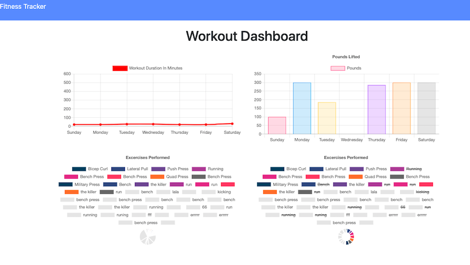

# Nosql: Workout Tracker

## Description

Create a workout tracker that will allow the user to view, create and track daily workouts. The user will have access to their stats (sets, reps, duration, distance, etc.)

## Table of Contents

1. [Installation](#Installation)
2. [Usage](#Usage)
3. [Github repository and Heroku deployed app link](#Github-repository-Heroku-deployed-link)
4. [App-screenshots](#App-screenshots)
5. [Questions](#Questions)

## Installation

- Make sure to `npm init` to get the `package.json` file, then `npm install` in your terminal.
- The dependencies are `mongoose`, `express`, for working with database and displaying HTML pages.

## Usage

- After opening the local host port in the browser, the user is able to add a new workout, complete a workout, view their last workout and access the stats dashboard.

### Github-repository-Heroku-deployed-link

- Github repository:
  [Github repository](https://github.com/JessicaPerez1/Fitness-Tracker.git)
- Heroku Deployed link:
  [Heroku deployed app link](https://sheltered-eyrie-16270.herokuapp.com/)

### App-screenshots

### Questions

For any questions about this app or if you'd like to contribute, please refer to my Github page or contact me by email!

- [JessicaPerez1 Github link:](https://github.com/JessicaPerez1)
- 1jessicaperez@gmail.com
